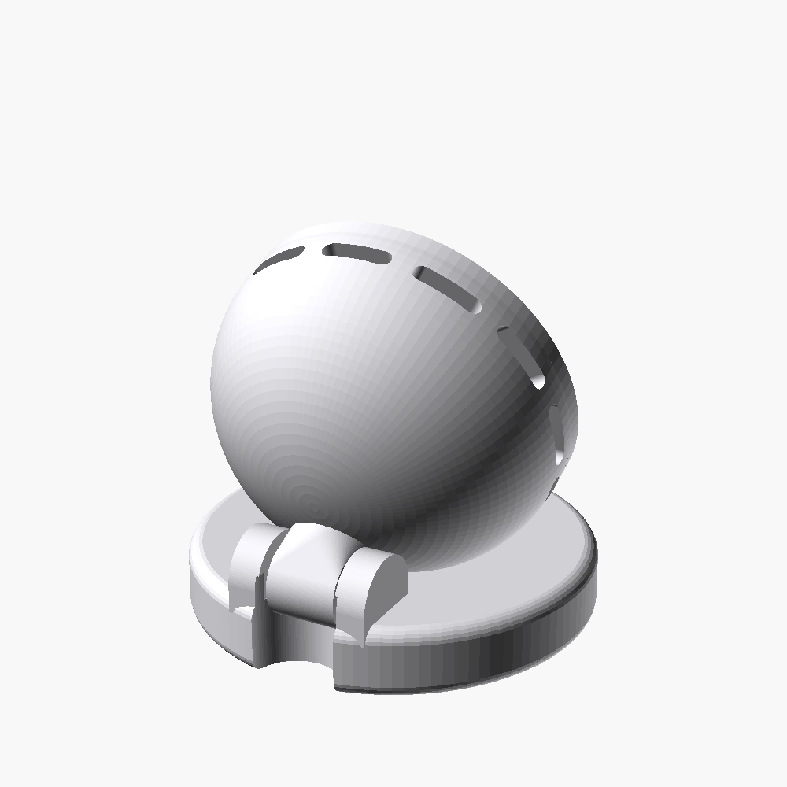
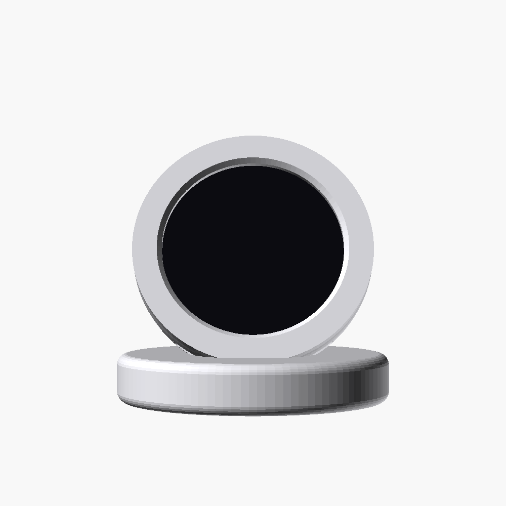

# PrintOrb Desk Stand — "Orb"

An elegant, screwless desk stand for the **Waveshare ESP32-S3-Touch-LCD-1.28**
that runs PrintOrb. Inspired by the smart-speaker / pocket-compact look: a
rounded **orb** that holds the round display, sitting on a low **disc** and
tilting on a **friction clamshell hinge** at the back.




## Parts (3 printed pieces, no screws)

| Part | File | Notes |
|------|------|-------|
| Orb body | `stl/printorb-orb.stl` | One-piece rounded puck, closed domed back, equator vent slots, hinge knuckle at the lower back. The PCB drops in from the front. |
| Bezel ring | `stl/printorb-bezel.stl` | Thin front ring; frames the display and snaps into the orb to retain the board. |
| Disc base | `stl/printorb-disc.stl` | Low round base with two hinge ears, a rear cable notch and rubber-foot recesses. |

The orb's two friction pegs snap into the disc ears → the orb tilts and holds
its angle by friction. Tune the grip with `friction_clear` (negative =
tighter).

## ⚠️ Before printing: measure your board

The model defaults to the published Waveshare spec but **revisions vary**.
Measure with calipers and set the `[Device]` parameters at the top of
`printorb-stand.scad`:

- `board_dia`   — diameter of the round PCB
- `board_thick` — total thickness, front glass to the tallest rear component
- USB-C position: the cutout sits at the orb's lower edge (`usb_w` × `usb_h`)

## Build (OpenSCAD ≥ 2021.01)

```bash
OSCAD="/c/Program Files/OpenSCAD/openscad.exe"      # adjust for your OS

# preview
"$OSCAD" -o preview.png --viewall --autocenter \
  -D 'part="assembly"' printorb-stand.scad

# export a part (orb | bezel | disc | plate)
"$OSCAD" -o stl/printorb-orb.stl -D 'part="orb"' printorb-stand.scad
```

## Recommended print orientation

- **Orb** — flat display face down on the bed. The closed dome prints upward
  as a self-supporting shell; the hinge knuckle may want a touch of support.
- **Bezel** — front face down.
- **Disc** — bottom down, as exported.

0.2 mm layers, 3 walls, 15 % infill, PLA/PETG. No supports needed except
optionally under the orb's hinge knuckle.

## Assembly

1. Drop the PCB into the orb (display toward the front opening), USB-C at the
   lower edge.
2. Press the **bezel ring** onto the front until it snaps — it traps the board.
3. Flex the disc ears apart and pop the orb's pegs into the sockets.
4. Route the USB-C cable through the rear notch in the disc.

## Key parameters

`printorb-stand.scad` is fully parametric — `wall`, `front_face_z` (front
flatness / ball-ness), `vent_count`, `bezel_overlap`, `lean` (display angle),
`disc_extra`, `friction_clear`, and the `[Placement]` block that positions the
orb on the disc.
